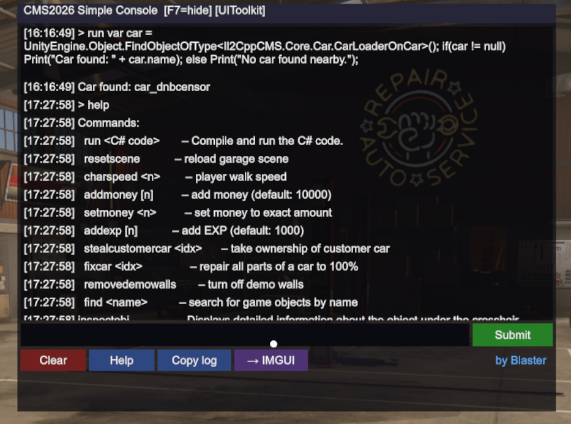

# CMS 2026 Simple Console
**Developer console and C# REPL for Car Mechanic Simulator 2026**


---

## 📖 Overview

**CMS 2026 Simple Console** is a developer-oriented tool created for modders and advanced users.  
It provides a powerful and transparent way to inspect, debug, and interact with the game built on the Unity 6 engine.

This tool allows you to explore internal systems, experiment with gameplay mechanics, and accelerate development workflows — without patching game files directly.

---

## 🚀 Core Feature — C# REPL Runtime
The main feature of this mod is the `run` command, which enables real-time execution of C# code during gameplay.

### Features
- **Live scripting** – Modify game state instantly
- **Full Unity access** – Use `UnityEngine` and `Il2CppCMS` namespaces
- **Runtime inspection** – Quickly locate and analyze objects

### Example
```csharp
run var car = UnityEngine.Object.FindObjectOfType<Il2CppCMS.Core.Car.CarLoaderOnCar>();
if (car != null)
    Print("Car found: " + car.name);
else
    Print("No car found nearby.");
```

---
## 🖥️ Console Commands
Press **F7** to toggle the console and enter commands:

* `run <C# code>` – Execute C# code at runtime
* `help` – Display list of available commands
* `find <name>` – Search for game objects by name
* `inspectobj` – Show detailed info about the object under the crosshair
* `dumpobj` – Copy object structure to clipboard
* `resetscene` – Reload the garage scene
* `scenes` – List all available scenes
* `addmoney [n]` – Add money (default: 10000)
* `setmoney <n>` – Set money to exact amount
* `addexp [n]` – Add EXP (default: 1000)
* `charspeed <n>` – Adjust player movement speed
* `fixcar <idx>` – Repair all car parts to 100%
* `stealcustomercar <idx>` – Take ownership of a customer car
* `showgaragecars` – List cars in the garage
* `showparkingcars` – List cars on the parking lot
* `removedemowalls` – Disable demo map restrictions

---

## 📦 Installation

### 1. Pre-requisites
* Ensure you have **MelonLoader v0.7.2** installed for *Car Mechanic Simulator 2026 Demo*.

### 2. Download & Extract
* Download the **[latest CMS 2026 Simple Console version](https://github.com/iBl4St3R/CMS2026-Simple-Console/releases)** from the Releases section.
* Extract the contents of the downloaded ZIP archive.

### 3. Copy Files
* Move the `CMS2026SimpleConsole.dll` from the **Mods** folder in the ZIP to your game's **`Mods`** directory.
* Move all DLL files from the **UserLibs** folder in the ZIP to your game's **`UserLibs`** directory.


**Default game path:**
```text
SteamLibrary\steamapps\common\Car Mechanic Simulator 2026 Demo\
```
---
## ⚠️ Known Issues

### UI Toolkit not loading (Error 0x800711C7)
You might encounter a `System.IO.FileLoadException` in the MelonLoader console regarding `UnityEngine.TextRenderingModule.dll`. This causes the UI Toolkit interface of this mod to fail, forcing a fallback to the simpler IMGUI renderer.

**Cause:**
This is **not a bug in the mod**. It is caused by a Windows 11 security feature called **Smart App Control**, which blocks unsigned DLL files generated dynamically by MelonLoader's `Il2CppAssemblyGenerator`.

**Solution:**
1. Open the **Start Menu** and search for **Smart App Control**.
2. Set it to **Off** (Note: Windows may require a certain state to change this, or it might be in 'Evaluation' mode).

---
## 📌 Notes
* This tool is intended for development and debugging purposes
* Use responsibly when modifying gameplay

---
## 📄 License
   For modding and educational use only. Not affiliated with Red Dot Games.